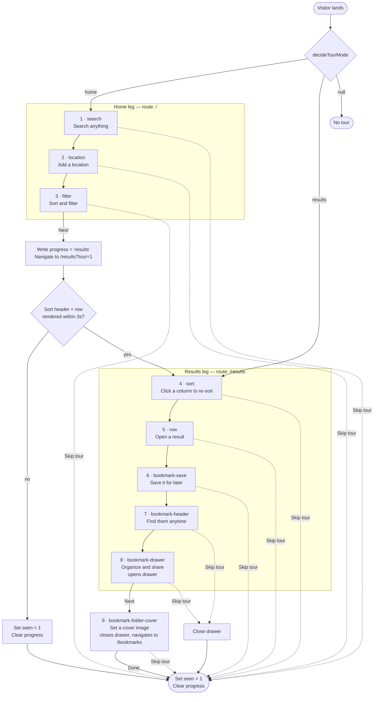

# Product tour — flow spec

Platform-agnostic reference for the first-visit product tour, written so the iOS
team can build the same experience with SwiftUI/TipKit. Every claim in this doc
is transcribed verbatim from `src/components/tour/TourController.jsx` and
`src/components/tour/decideTourMode.js` — treat those files as the source of
truth if this doc ever drifts.

---

## 1. Overview

The tour is a nine-step guided walk-through of the site's main features. It runs
across two "legs":

- **Home leg** (3 steps) — introduces search, location targeting, and the
  sort/filter menu on `/`.
- **Results leg** (6 steps) — teaches column-sort, row expansion, and the four
  bookmark surfaces (save button, header icon, drawer, cover-image folder view)
  on `/results` and `/bookmarks`.

Between the two legs, the tour hands off by writing a `progress` key to
`localStorage` and navigating to `/results?q=organic+soap&country=US&tour=1`.
The `results` leg resumes automatically when the router lands there.

**When it runs**

| Condition | Result |
|---|---|
| First visit to `/` | Auto-fires the home leg after a `requestIdleCallback` tick. |
| Visits `/` with `?tour=1` (from the *Take the tour* button) | Auto-fires the home leg even if the tour was previously seen. |
| Arrives at `/results` mid-handoff (`progress = "results"` in storage) | Auto-fires the results leg. |
| Visits `/results` with `?tour=1` deep link | Auto-fires the results leg. |
| Any other route | No tour. |

**Shepherd.js** is the desktop implementation. It's lazy-loaded (~50 KB) so
returning visitors never download it. iOS should use whichever spotlight
mechanism is idiomatic for the SDK target — see §6.

---

## 2. State model

Two `localStorage` keys govern the tour. Names are versioned so a future v2 can
re-fire cleanly without stomping v1 users.

| Key | Values | Purpose |
|---|---|---|
| `tabarnam_tour_v1_seen` | `"1"` or absent | Set when the tour completes or the user cancels. Suppresses future auto-fires. |
| `tabarnam_tour_v1_progress` | `"results"` or absent | Set during the home→results handoff; tells the results-mount to auto-resume. Cleared on completion or cancellation. |

The URL param `?tour=1` acts as a force-start override that bypasses `seen`.
It's how the *Take the tour* button on `/how-it-works` triggers a replay for
users who've already dismissed the tour.

### Decision truth table (`decideTourMode`)

Returns `'home'`, `'results'`, or `null`.

| Route | `?tour=1` | `seen` | `progress` | Mode |
|---|---|---|---|---|
| Not `/` or `/results` | — | — | — | `null` |
| `/` | ✓ | any | any | `home` (force-start) |
| `/` | ✗ | set | any | `null` (dismissed) |
| `/` | ✗ | absent | `"results"` | `null` (handoff in flight) |
| `/` | ✗ | absent | absent | `home` (fresh) |
| `/results` | ✓ | any | any | `results` (force-start) |
| `/results` | ✗ | any | `"results"` | `results` (resume) |
| `/results` | ✗ | any | absent | `null` |

---

## 3. Flow diagram

Every step also has a `Learn more` button that opens the corresponding section
of `/how-it-works` in a new tab; those edges are omitted from the diagram to
keep it readable.

---

## 4. Step spec

Each row lists a step's ID, route, title, body copy (**verbatim**), anchor
selector on desktop, buttons in display order, and any side effect that fires
before the step is shown.

### Home leg (`/`)

| # | ID | Title | Copy | Anchor | Buttons | Side effect |
|---|---|---|---|---|---|---|
| 1 | `search` | Search anything | `Type a company name, product, or industry. Try <strong>Jelly Belly</strong> or <strong>organic bar soap</strong>.` | `[data-tour-step="search-input"]` | Skip tour · Learn more (`#searching`) · Next | — |
| 2 | `location` | Add a location | `You can type a city, postal code, or country to orient results around that place.` | `[data-tour-step="location-input"]` | Skip tour · Back · Learn more (`#location`) · Next | — |
| 3 | `filter` | Sort and filter | `Open this menu to sort by nearest, highest rated, or filter to in-country only.` | `[data-tour-step="filter-trigger"]` | Skip tour · Back · Learn more (`#sorting`) · Next → **handoff** | — |

**Handoff (fires when step 3's Next is tapped):**

1. Write `tabarnam_tour_v1_progress = "results"`.
2. Detach the current Shepherd finalize handlers so the imminent cancel-during-teardown doesn't finalize.
3. Navigate to `/results?q=organic%20soap&country=US&tour=1`.
4. On mount, `TourController` re-decides mode, starts the results leg once the required elements are on the page.

### Results leg (`/results`, then `/bookmarks`)

| # | ID | Title | Copy | Anchor | Buttons | Side effect |
|---|---|---|---|---|---|---|
| 4 | `sort` | Click a column to re-sort | `Click the <strong>QQ</strong> header to sort by score. Click <strong>HQ</strong> or <strong>Manufacturing</strong> to re-sort by proximity.` | `[data-tour-step="sort-header-qq"]` | Skip tour · Learn more (`#qq`) · Next | — |
| 5 | `row` | Open a result | `Click any row to expand it into the full company profile, including all locations, reviews, and links.` | `[data-tour-step="expandable-row"]` | Skip tour · Back · Learn more (`#row`) · Next | — |
| 6 | `bookmark-save` | Save it for later | `Tap the bookmark icon to save any company. Tap it again to file it under a custom list.` | `[data-tour-step="bookmark-button"]` | Skip tour · Back · Learn more (`#bookmarks`) · Next | — |
| 7 | `bookmark-header` | Find them anytime | `Your saved companies live behind this bookmark icon in the header.` | `[data-tour-step="bookmark-header-icon"]` | Skip tour · Back · Learn more (`#bookmarks`) · Next | — |
| 8 | `bookmark-drawer` | Organize and share | `Group bookmarks into named lists, drag to reorder, and share a list as a compressed link — no account required.` | `[data-tour-step="bookmark-drawer-root"]` | Skip tour · Back · Learn more (`#bookmarks`) · Next | **Open the bookmarks drawer** and wait for its slide-in transition (~350 ms) before the spotlight is drawn. Skip/Back close the drawer first. |
| 9 | `bookmark-folder-cover` | Set a cover image | `Give any list a personal cover. Open the folder, then choose <strong>⋯ → Set Cover Image</strong> to upload one or paste a URL.` | `[data-tour-step="bookmark-folder-card"]` | Skip tour · Back · Learn more (`#bookmarks`) · **Done** | **Close the drawer**, navigate to `/bookmarks`, then race a 1.5 s wait for the folder-card anchor against an 800 ms fallback timer. If the visitor has no custom lists, the anchor never resolves and the step shows as a centered modal (still teaches the feature). |

**Completion:** on `Done` (step 9) or when Shepherd's `complete`/`cancel` fires
elsewhere, `TourController.finalize()` runs:

1. Write `tabarnam_tour_v1_seen = "1"`.
2. Remove `tabarnam_tour_v1_progress`.
3. Close the bookmarks drawer if it's still open (defensive).

### Graceful skip

If the results leg mounts but the required elements
(`[data-tour-step="sort-header-qq"]` and `[data-tour-step="expandable-row"]`)
don't appear within **3 s**, the tour marks itself as seen and never renders a
step. This protects against empty result sets or slow API responses.

---

## 5. Triggering and replay

### Auto-fire

`TourController` mounts inside `<Layout>` and re-runs its `useEffect` on every
route change. If `decideTourMode` returns a mode, Shepherd is lazily imported
and the leg starts inside a `requestIdleCallback` (fallback: 400 ms
`setTimeout`).

### Manual replay — "Take the tour" button

Location: `src/pages/HelpPage.jsx`, header row of the `/how-it-works` page.
It's a `<Link to="/?tour=1">` styled as a small button with a Play icon. Clicking
it navigates to the homepage with the force-start query param, which restarts
the home leg regardless of the `seen` flag.

### Deep link

Both `/?tour=1` and `/results?...&tour=1` are supported entry points. The
results deep link is what the home leg produces during the handoff; the home
deep link is exposed as the manual-replay affordance.

---

## 6. iOS adaptation guidance

The desktop tour is a stateful, cross-page walk-through. When rebuilding on
iOS, keep the copy verbatim (users on both platforms should hear the same
words) and preserve the step order. Adapt only the mechanics.

### Copy

All titles and body strings above must render identically on iOS. HTML tags in
the body copy (`<strong>`, `⋯`, en-dash) should be honored via
`AttributedString` or SwiftUI's markdown initializer. There are no
localizations yet — English-only is acceptable for parity.

### Spotlight mechanism

- **Steps 1–7** (search input, location input, filter menu, sort column,
  result row, bookmark button, header bookmark icon) are simple point-at-an-
  element steps. **TipKit** (iOS 17+) is a good fit; each step becomes a
  `Tip` bound to the target view via `.popoverTip(_:arrowEdge:)`.
- **Step 8** (bookmark-drawer) needs to open a sheet/side panel before
  spotlighting, and the spotlight has to fall on the sheet contents. Custom
  SwiftUI overlay with a dimmed background + focus ring is preferable to TipKit
  here; use the app's existing bookmarks sheet as the target.
- **Step 9** (bookmark-folder-cover) navigates to another tab/screen and needs
  a fallback to a centered modal when no custom folder exists. Custom overlay
  again.

For "Learn more" buttons: open the same `/how-it-works` URL in an in-app
Safari view (`SFSafariViewController` or SwiftUI's `.sheet` with a
`WebView`).

### State

Mirror the two `localStorage` keys in `UserDefaults`:

- `TabarnamTourV1Seen` (Bool)
- `TabarnamTourV1Progress` (String? — `"results"` or nil)

The version suffix `V1` should be kept so a coordinated future v2 can retire
both platforms at once.

### Deep link

Register a URL scheme like `tabarnam://tour/start` that acts as the iOS
equivalent of `/?tour=1`. The *Take the tour* affordance inside the app's
Help/Settings screen taps this URL.

### Handoff between legs

The desktop handoff is a route change. On iOS:

1. User taps the last button of the home leg's third step (`Sort and filter`).
2. Write `progress = "results"`.
3. Programmatically switch the tab controller / navigation stack to the
   Results tab.
4. Fire the canned search (`"organic soap"`, country `US`) if the app supports
   it, or wait for the user to run a search.
5. On the Results tab's `onAppear`, check for `progress = "results"` and start
   the results leg once at least one result row is on screen (mirrors the
   desktop 3-second graceful-skip).

### Drawer step (step 8)

The drawer is a side sheet on desktop. On iOS the equivalent is likely a
bottom sheet or a full-screen tab. Whichever surface hosts bookmarks: bind the
spotlight to its root view and reproduce the "open before spotlighting, close
on Skip/Back" behavior.

### Cover-image step (step 9)

The folder grid lives at `/bookmarks`. On iOS this is presumably the
Bookmarks tab. When entering the step, navigate to the tab first, then attach
the spotlight to the first custom folder card (i.e. any list that isn't the
built-in "All Bookmarks"). If the user has no custom lists, show the step
centered.

### Completion

Set `TabarnamTourV1Seen = true`, clear `TabarnamTourV1Progress`, and close any
bookmarks sheet the tour opened.

---

## 7. Change log

When either platform adds, removes, or renames a step:

1. Update the code (`TourController.jsx` or the iOS equivalent).
2. Update this doc's step spec table with the new copy, anchor, and side
   effects.
3. Mention the change in the PR description of both platforms' tickets so the
   sibling team notices.
4. If the `seen`-key gate needs to re-fire the tour for everyone (major
   redesign), bump both localStorage and UserDefaults keys from `V1` to `V2`
   in the same release cycle.

**Sources of truth:** `src/components/tour/TourController.jsx` (steps),
`src/components/tour/decideTourMode.js` (state gate), this doc (cross-platform
spec).
